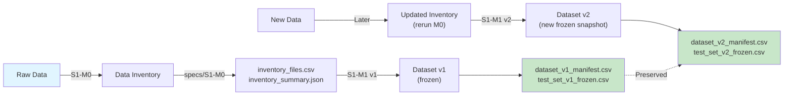
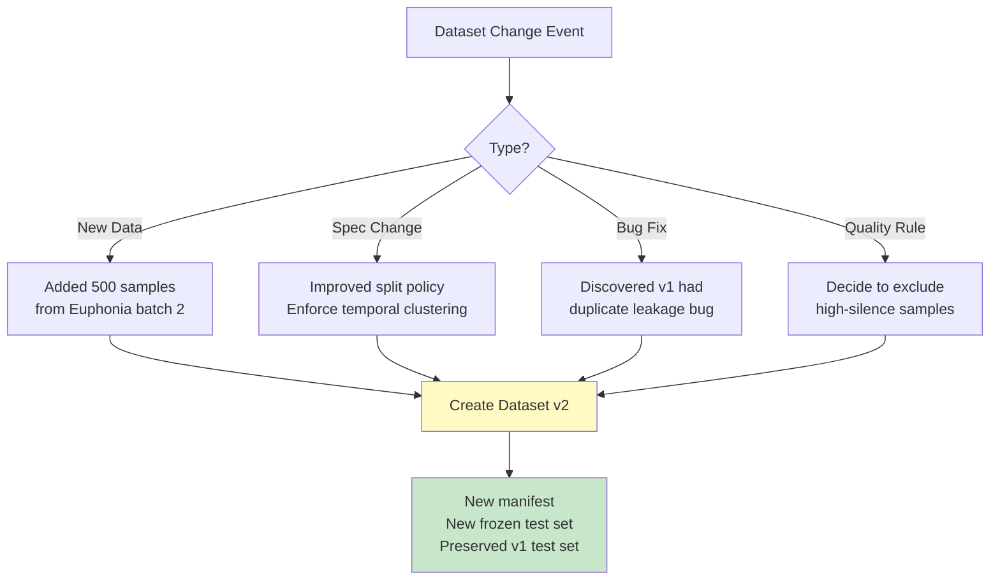
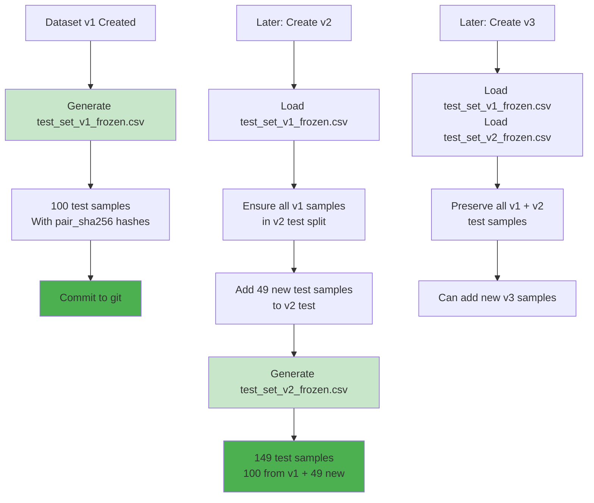

# Dataset Versioning Strategy

## Overview

This document explains how dataset versions (v1, v2, v3, ...) work in
VOX Personalis and why the design prevents confusion and ensures
reproducibility.

**Key principle:** Each dataset version is an immutable snapshot with
frozen test set. Future versions preserve and build upon it.

______________________________________________________________________

## Why Hard-Coded "v1" in the Spec?

The specification
[`specs/S1-M1-dataset-versioning.md`](specs/S1-M1-dataset-versioning.md)
defines Dataset v1 **specifically**.

```text
Spec document: "Rules for creating Dataset v1"
  ↓ (NOT a template, a specific definition)
Implementation code: Parameterized to accept --dataset_version v1|v2|v3...
```

**Analogy:**

- You don't write "Recipe for House v1 or v2"
- You write "Recipe for House v1 in 2024" (immutable)
- Later you write "Recipe for House v2 in 2025" (new document)

This ensures:

- ✅ No ambiguity: "Which rules applied to v1?" → Check `specs/S1-M1-dataset-versioning.md`
- ✅ No accidental modifications: v1 spec can't be changed
- ✅ Clear lineage: v2 can reference v1's frozen test set

______________________________________________________________________

## Information Flow Across Dataset Versions



______________________________________________________________________

## Folder Structure for Dataset Versions

```text
VOX_Personalis/
├── specs/
│   ├── S1-M0-data-inventory.md
│   └── S1-M1-dataset-versioning.md        (v1 specification)
│
├── dataset-versions/
│   ├── CHANGELOG.md                        (master record)
│   ├── v1/
│   │   ├── dataset_v1_spec.md             (snapshot of S1-M1 used for v1)
│   │   ├── dataset_v1_applied_rules.md    (what actually ran)
│   │   └── dataset_v1_metadata.json
│   ├── v2/
│   │   ├── dataset_v2_spec.md             (modified for v2)
│   │   ├── dataset_v2_applied_rules.md
│   │   └── dataset_v2_metadata.json
│   └── v3/ ... (future)
│
├── DATASET-VERSIONING-STRATEGY.md          (this file)
├── README.md
└── ...
```

______________________________________________________________________

## When to Create v2 (and Beyond)

Create a **new dataset version** when any of these occur:



**Examples:**

| Scenario                       | Action    | Result                       |
| ------------------------------ | --------- | ---------------------------- |
| Record new Euphonia samples    | Create v2 | New data, v1 test set saved  |
| Discover v1 had duplicates     | Create v2 | Bug fixed, v1 test set saved |
| Enforce temporal clustering    | Create v2 | Improved split policy        |
| Add silence threshold cleaning | Create v2 | New cleaning rules applied   |

______________________________________________________________________

## Step-by-Step Process: Creating v2

### **Step 1: Document the Change**

Edit `dataset-versions/CHANGELOG.md`:

```markdown
## v1 → v2 (2024-02-20)

**Reason:**
- Added 500 new Euphonia samples (batch 2)
- Discovered temporal session leakage in v1 test set

**Changes:**
- Split Policy: Enforce temporal clustering (was optional in v1)
- Session gap: Changed from 60s to 30s
- See full spec: specs/dataset-versions/v2/dataset_v2_spec.md

**Data Impact:**
- Input: 1000 → 1500 samples
- Excluded (temporal leakage): 15
- Final: 1500 → 1485
- Test set: v1 samples (100) + new (49) = 149

**Backwards Compatibility:**
- v1 test set PRESERVED (all 100 samples in v2 test)
- Model trained on v1 can be fairly compared against v2 models
```

### **Step 2: Create v2 Spec Snapshot**

```bash
# Copy the base spec as a snapshot
cp specs/S1-M1-dataset-versioning.md \
   dataset-versions/v2/dataset_v2_spec.md

# Edit to document changes
# Modify sections like "Split Policy Step 4" to show what changed
```

**Example edit in dataset_v2_spec.md:**

```markdown
#### Split Policy Changes (v1 → v2)

- **Step 4: Temporal Clustering Check**
  - v1: "detected but not enforced"
  - v2: "detected AND enforced" ← NEW
  - Session gap: 60s (v1) → 30s (v2) ← NEW
```

**Reference path:** `dataset-versions/v2/dataset_v2_spec.md`

### **Step 3: Run Dataset Creation**

```bash
# Run v2 generation with new inventory
python -m vox_dataset_versioning \
  --inventory_dir ./out/inventory/20240220 \
  --dataset_version v2 \
  --seed 42 \
  --spec_file dataset-versions/v2/dataset_v2_spec.md \
  --enforce_temporal_clustering \
  --verbose
```

### **Step 4: Verify Test Set Continuity**

Script automatically validates:

```python
# Load v1 test set
v1_test = pd.read_csv("test_set_v1_frozen.csv")

# Check v2 preserves it
v2_test = pd.read_csv("dataset_v2_manifest.csv")[df.split == "test"]

assert all(v1_test.pair_sha256.isin(v2_test.pair_sha256))
# ✅ All v1 test samples are in v2 test
```

### **Step 5: Commit to Git**

```bash
git add \
  dataset-versions/v2/dataset_v2_spec.md \
  dataset-versions/v2/dataset_v2_applied_rules.md \
  dataset-versions/CHANGELOG.md \
  dataset_v2_manifest.csv \
  test_set_v2_frozen.csv \
  dataset_v2_summary.json

git commit -m "feat(dataset): create Dataset v2 with temporal clustering enforcement"
```

______________________________________________________________________

## How Code Stays Parameterized

The implementation code is **NOT** hard-coded:

```python
# scripts/dataset_versioning.py

def create_dataset(
    inventory_dir: str,
    dataset_version: str = "v1",  # ← Parameterized
    seed: int = 42,
    ...
) -> None:
    """Create a dataset version."""

    # Load spec for THIS version
    spec_path = f"specs/dataset-versions/{dataset_version}/dataset_{dataset_version}_spec.md"
    spec = load_spec(spec_path)

    # Generate manifest with dynamic version
    manifest = generate_manifest(
        dataset_version=dataset_version,  # ← Dynamic
        excluded=excluded,
        splits=splits,
    )

    # Save with version in filename
    manifest.to_csv(f"dataset_{dataset_version}_manifest.csv")
    ...
```

**Usage:**

```bash
# Create v1
python -m vox_dataset_versioning --dataset_version v1

# Create v2 (same code, different version)
python -m vox_dataset_versioning --dataset_version v2

# Create v3 (same code, different version)
python -m vox_dataset_versioning --dataset_version v3
```

______________________________________________________________________

## Test Set Preservation: How It Works



**Why this matters:**

| v1 Model      | v2 Model           | v3 Model           |
| ------------- | ------------------ | ------------------ |
| Trained on v1 | Trained on v2      | Trained on v3      |
| v1 test (100) | Same v1 test (100) | Same v1 test (100) |
| v1 WER: 15%   | v2 WER: 12%        | v3 WER: 10%        |
|               | Fair comparison ✅ | Fair comparison ✅ |

______________________________________________________________________

## FAQ

### **Q: Why can't we just modify the v1 spec?**

**A:** Because once v1 is locked and trained-on, changing the spec breaks reproducibility.

If you modify `specs/S1-M1-dataset-versioning.md`, then:

- Old code + old spec = reproducible v1
- Old code + new spec = broken v1 (which spec was used?)
- New code + new spec = new dataset, not v1

Creating v2 is cleaner: old code + v1 spec = v1, new code + v2 spec = v2.

______________________________________________________________________

### **Q: What if we find a bug in v1?**

**A:** Create v2 with the bug fix.

```text
v1: "Bug: duplicates not detected properly"
v2: "Bug fixed: duplicates now excluded correctly"

Both exist in git history.
Models trained on v1 still work.
v2 becomes the new reference.
```

______________________________________________________________________

### **Q: Do we need CHANGELOG.md?**

**A:** Yes. It's the **single source of truth** for dataset evolution:

```text
# Find what changed between versions
cat dataset-versions/CHANGELOG.md

# Find exact spec for v1
cat dataset-versions/v1/dataset_v1_spec.md

# Find what actually ran for v1
cat dataset-versions/v1/dataset_v1_applied_rules.md
```

______________________________________________________________________

### **Q: Can we skip dataset versions?**

**A:** No. Always create v2, then v3, etc. This ensures:

- Clear lineage (v1 → v2 → v3)
- Test set continuity (each preserves previous)
- Git history is clean (each commit is meaningful)

______________________________________________________________________

## Reference from Spec

In `specs/S1-M1-dataset-versioning.md`, add this link at the end:

```markdown
______________________________________________________________________

## Extending to v2, v3, ...

This specification defines Dataset v1.

When you need to create Dataset v2 (new data, improved rules, bug fixes):
- See: [DATASET-VERSIONING-STRATEGY.md](../DATASET-VERSIONING-STRATEGY.md)
- Create snapshot: `dataset-versions/v2/dataset_v2_spec.md`
- Update: `dataset-versions/CHANGELOG.md`
- Run with: `python -m vox_dataset_versioning --dataset_version v2`

Test set v1 will be automatically preserved in v2.
```

______________________________________________________________________

## Summary

| Concept             | Meaning                | Example                       |
| ------------------- | ---------------------- | ----------------------------- |
| **Spec**            | Create a version       | `S1-M1-dataset-versioning.md` |
| **Snapshot**        | Archive spec copy      | `v1/dataset_v1_spec.md`       |
| **Dataset**         | Immutable artifact     | `dataset_v1_manifest.csv`     |
| **Frozen Test Set** | Reproducible eval lock | `test_set_v1_frozen.csv`      |
| **CHANGELOG**       | All versions record    | `CHANGELOG.md`                |

✅ **Result:** Clear versioning, no ambiguity, reproducible across time.
